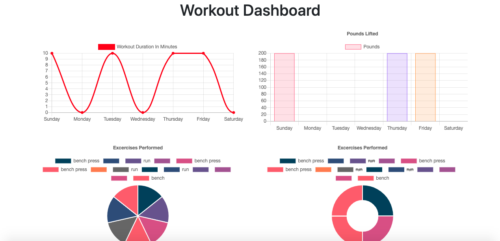

# Workout Tracker
## Description: 
This project allows people to keep tracker of important details about their workouts. Things like reps, sets and distance.
## Table Of Contents:
* How To Install
* Usage
* Technology Used/Badges
* Contributors
* Tests
* GitHub
## How To Install: 
Simply travel to deployed link in your browser.
## Usage:
Start a wokout bye clicking "New Workout" and then choose between resistance or cardio. Then enter in information about the exercises you're performing. You can add more exercises or start a new workout. There's also a fitness dashboard that shows you stats about your workout on graphs so you can easily measure your progress.

## Technologies Used/Bagdes: 

## Lisence:  
MIT
## Contributors:
Edwin Genova
## Tests:
None

